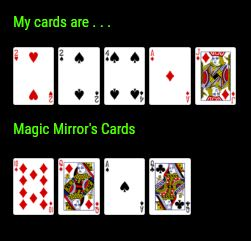

## MMM-CARDS
Play 5 Card Stud Poker against your mirror

## How it works

Your mirror is always the dealer. Each hand starts with a newly shuffled deck of 52
standard playing cards. You get the 1st, 3rd, 5th, 7th and 9th cards, just as you would 
when playing heads up poker. Your mirror gets the 2nd, 4th, 6th, 8th and 10th cards, just
as it would if it were the dealer playing heads up poker. Your hand is exposed first, one
card at a time. Then the mirror's cards are exposed, one at a time. 

When the hand is over, a new hand starts with newly shuffled deck of 52 cards.

## Examples

* Your mirror's hand being exposed

* Annotated .css file included for aligning and coloring text and header.

## Installation

* `git clone https://github.com/mykle1/MMM-CARDS` into the `~/MagicMirror/modules` directory.

* No API needed! No dependencies needed! 

## Config.js entry and options

    {
        module: 'MMM-CARDS',
        position: 'top_left',
        config: { 
		useHeader: false,              // true if you want a header
		header: "5 Card Stud Poker",   // Any text you want
		maxWidth: "100%",              // Stretch or constrain according to region
		animationSpeed: 3000,          // New clue fades in and out
        }
    },
	

## Special thanks to SpaceCowboysDude
